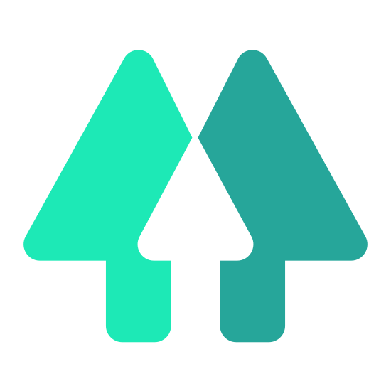

# Welcome!
## 👋 Hi there, I am [LightslicerGP][linktree]
---
### I am a student that loves to game and code!
- 🔭 I’m currently working on a 16 Bit CPU, and probably a ton of other projects
- 🌱 I’m currently learning HTML/CSS/JScript/NodeJS/AoijJS/Python/C++/C/Assembly
- 🫱🏻‍🫲🏾 I’m looking to collaborate on a site someone would like for me to help with
- 🤔 I’m looking for help with some UI and UX decisions on my website
- 💬 Ask me about how my day was, and my favorite quote
- 📫 How to reach me: Lightslicerandpuzzlegamer@gmail.com or LightslicerGP on many social media platforms (view below)
- 😄 Pronouns: He/Him
- 🎂 Birthday: June 8th
- ⚡ Fun fact: I am pretty good at Minecraft Parkour (OJ)

[][NetlifySite]

## Socials

[][Youtube]
[][Linktree]
[][GoogleSite]
[][NetlifySite]
[][GitHubSite]
[][Discord]
[][Instagram]
[][Twitter]
[][Twitch]
[][Reddit]
[][SubReddit]
[][TikTok]
[][Snapchat]
[][FaceBook]
[][Mixer]

# Current Projects
## Websites
- [Main website/portfolio](https://lightslicergp.netlify.app)
- [OneUI Web css plugin file](https://oneuiweb.netlify.app/)
- Personal Portfolio Website

## Minecraft
- [SimplyCubed (so far most textures are done, with Raytracing and Vibrant Visuals in the works, and a Java version)](https://mcpedl.com/user/lightslicergp/)
- SimplySkin (so far, [Steve](https://mcpedl.com/skins/simplyskin-steve/) and [Alex](https://mcpedl.com/skins/simplyskin-alex/) have been done)
- [SimplySurvival](https://mcpedl.com/simplysurvival-map/)
- [Blocks in Blocks Renewed](https://modrinth.com/resourcepack/blocks-in-blocks-renewed)
- [Deepfried](https://modrinth.com/project/deepfried-multibit)
- Creators Colors
- Skyblock+ (might rename to somth else)
- Bedrock Word Processor
- RGB Display Prototype
- Single Redstone Line Serial Display
- Minigames Map (8, mabye more, minigames)
- World Economy Emulator (jobs, plots, stocks and other stuff? idk)

## Programming
- [Excpute (an 8, and an upcoming 16 bit CPU)](https://github.com/LightslicerGP/Excpute)
- Compiler for the CPU (its hard 😭)
- [Discord Bot v3 (updated to have parity between a python and aoijs version compared to v2)](https://github.com/LightslicerGP/LightslicerGPBotV3)
- [YouTube Music Downloader _**(FOR EDUCATIONAL PURPOSES**_...*allegedly*)](https://github.com/LightslicerGP/YTMDL)
- [(*the best imo*) Minecraft Redstone Lamp Display Emulator](https://github.com/LightslicerGP/RedstoneLampDisplay)
- [Minecraft RGB Display Emulator (emulate a 2 bit per subpixel rgb display from minecraft in python)](https://github.com/LightslicerGP/MinecraftRGBDisplay)
- Source Code for Blocks in Blocks renewed
- Source Code for Creators Colors

## Videos
- SimplyCubed (redo [main video](https://youtu.be/kblVzVHY3Y0), make RTX and VV video) (Using [`Loyal - Odesza`](https://youtu.be/dnOw8lNy3lQ), and [`Lets Live - AKJ`](https://youtu.be/3XRWMLWH8nI))
- SimplySurvival (redo [main video](https://youtu.be/OpP3qRX_DEk) as well with RTX/VV) (Using [`Area - MagnustheMagnus`](https://youtu.be/CbBlAay3E6Q))
- SimplySkin (make video, also with RTX/VV) (Using [`Hyperspace - Sam I & TRY`](https://youtu.be/cWS2GsEeUJk))
- SimplyCraft (compile all 3 packs together in one short, and one long video) (Using [`Get Up - Terrell Hines`](https://youtu.be/HY4PtcctoVc) and [`Binx - Obylx`](https://youtu.be/n7GrrsD2jvs) and a custom script)
- Creators Colors (Using [`Keep on Lovin' - MagnustheMagnus`](https://youtu.be/zORpRdVpaKo) or [`Apocalypse - PYRMDPLAZA`](https://youtu.be/wMf-gqiFyCc) im unsure)
- MCPKOJ Season `X` Volume `X` ([S1 Complete](https://youtube.com/playlist?list=PLG5Wd810mzkqIKA2VJb8o_k-zl87zjUfB), S2 Incoming)
- 5 years of MCPK, parkour progress
- Minecraft Bedrock Word Processor with Just Redstone
- Minecraft RGB Display with Just Redstone
- Minecraft Serial Display over one Redstone Line
- BWMM's 2 Extended [(add more bwmm strats to this video)](https://youtu.be/-wFM8pGgAwA)
- [`Glitterati - Fox Morrow`](https://youtu.be/9Ze3xmrju7s) Forza Horizon (3) "Music Video"
- Possibly some edits, and/or valorant gameplay (with an edit)
- Tons of other videos I have recorded but yet to upload

## Other
- All Apple and Samsung phone wallpapers
- [OneUI 4 Icon Recreations](https://www.reddit.com/r/oneui/comments/1erljr8/for_those_who_dont_like_the_oneui5oneui7_icons_i/)
- [OneUI Specialty Widgets](https://www.reddit.com/r/oneui/comments/u4hmti/i_have_a_few_of_them_done/)
- General Android Widget

 
If there is any files you see that you like, feel free to use them how you will and JUST GIVE CREDIT! Any files in any folders in this github page are just experimental and temporary, so they arent for actual use.

[youtube]: https://youtube.com/LightslicerGP
[linktree]: https://linktr.ee/LightslicerGP
[googlesite]: https://sites.google.com/view/lightslicergp/home
[netlifysite]: https://lightslicergp.netlify.app
[githubsite]: https://lightslicergp.github.io/Website/
[collab]: https://goo.gl/forms/rh59cEY56UzOz4zQ2
[discord]: https://discord.gg/3TGX6RA
[instagram]: https://www.instagram.com/lightslicergp
[twitter]: https://twitter.com/LightslicerGP
[twitch]: https://www.twitch.tv/lightslicergp
[reddit]: https://www.reddit.com/user/LightslicerGandP
[subreddit]: https://www.reddit.com/r/LightslicerGP
[tiktok]: https://www.tiktok.com/@lightslicergp
[snapchat]: https://www.snapchat.com/add/lightslicergp
[facebook]: https://www.facebook.com/LightslicerGP
[mixer]: https://www.mixer.com/LightslicerGP
